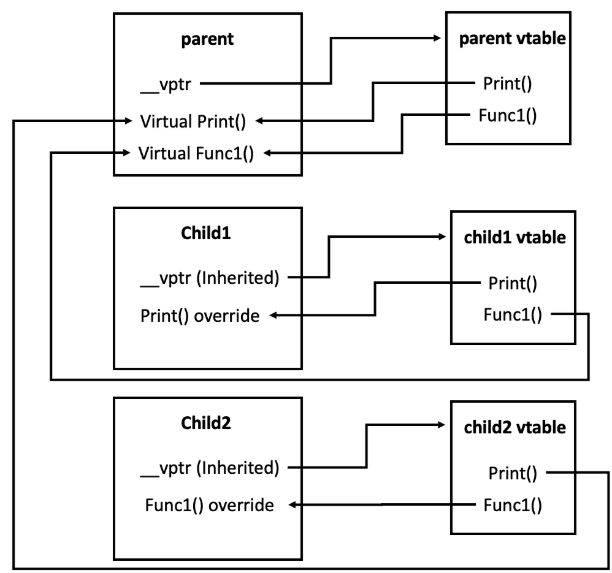

# Наследяване

**Интересни случай**

- виртуални таблици (ами деструктора?)
  

## Задачи за проект

**Задачи с наследяване за Character**
базовият class Character трябва да има методи attack() и defend(), при **атака и защита да се изписва класа и името на обекта**; да не може да се създават инстанции от Character. Да се направят големи 5-ци - да се помисли за деструкторите.

- `Assassin`: с атрибут float dexterity <= 5 и attack(), която е с формула- dexterity _ weapon scale _ strength и defend, която поема толкова щети колкото е атаката на противника.
- `Sorcerer`: атака с формула: weaponIntScale \* inteligence, defend- няма защита
- `Warrior`: има 0 <= armor <= 0.5, 0<= sorceryDeff <= 0.5 и атака str \* weapon, и защита - магическата щета на опонента без процента на sorceryDeff събрано с физическата щета без процента на armor
- `Pet`: има функция за бъф на собственика- подаден при създаване или със сетър- това му е единствената функция няма атака и защита(освен ако функцията не е такава)
- `Owner`: има Pet и атаката и защитата са му базови + buff на Pet.
  **Задачи за наследяване на Arena**

- Arena: масив от character\* трябва да има виртуална функция battle() и не може да се инстанцира

- `FrostArena`- всички играчи от клас assassin са двойно по неефективни в атака
- `NoМagic`- битки забранява се Sorcerer да участва.
- `TeamsArena`- клас срещу клас битка- до последен оцелял от един клас

## Хора които не правят примерния проект (Система за менежиране на работници)

### Лесни задачки

**Задача 1**

Направете базов клас `Person`, с следните член данни и член функции:

- Функцията `void start()`
- Уникален идентификационен номер
- Име (Името по подразбиране е `Georgi`)

Пример:

```c++
Person* p1 = new Person("John");
p1->start(); // Output: "Starting John, ID: 1"
```

**Задача 2**

Напишете два класа `Sales` и `Engineer`, двата класа трябва да наследяват `Person`, като трябва да имат следния изход:

Пример:

```c++
Sales pt;
pt.start(); // Output: "Georgi starting to sell, ID: 1"

Engineer ct;
ct.start(); // Output: "Georgi starting to code, ID: 2"
```

**Задача 3**
Имплементирайте конструктор, деструктор, копи конструктор и move семантики за всички класове.

Пример

```c++
Sales a;
Sales b = a;
std::cout << a.getId() << " " << b.getId(); // Output: "1 1"
```

### Средни задачки

**Задача 4**
Имплементирайте базовия клас `SchedulingSoftware`, със следните член функции

- `bool schedulePerson(Person* p);` Записва че дадения човек трябва да бъде вкаран в работния софтуер
- `Person* getNext();` Взима следващия човек който ще работи

**Задача 5**
  Имплементирайте класа `QueueScheduler`, който всеки път като се извика `getNext()` връща човека най-напред в опашката и след това го поставя най-отзад.

Пример:

```c++
QueueScheduler qs;
qs.schedulePerson(&pt);
qs.schedulePerson(&ct);
qs.getNext() // Output: pt
qs.getNext() // Output: ct
qs.getNext() // Output: pt
```

**Задача 6**
Имплементирайте класа `RandomSchduler`, който всеки път като се извика `getNext()` връща случаен човек от добавените хора

Пример:

```c++
RandomSchduler rs;
rs.schedulePerson(&pt);
rs.schedulePerson(&ct);
rs.getNext() // Output: ct
rs.getNext() // Output: ct
rs.getNext() // Output: pt
```

### Трудни задачки

**Задача 7**
Променете класовете за работници така че да има работници с приоритет.

```c++
PrioritisedWorker w1(5), w2(1);
w1.getPriority(); // Output: 5
```

**Задача 8**
Напратете клас `PriorityScheduler`, който винаги избира работника с най-висок приоритет, като един работник е взет той се маха от списъка от работници.

```c++
PriorityScheduler ps;
ps.schedulePerson(&w2);
ps.schedulePerson(&w1);
ps.getNext() // Output: w1
ps.getNext() // Output: w2
```

**Задача 9**
Имплементирайте, конструктор, деструктор, копи конструктор, move семантики и operator[] за класа `PriorityScheduler`
