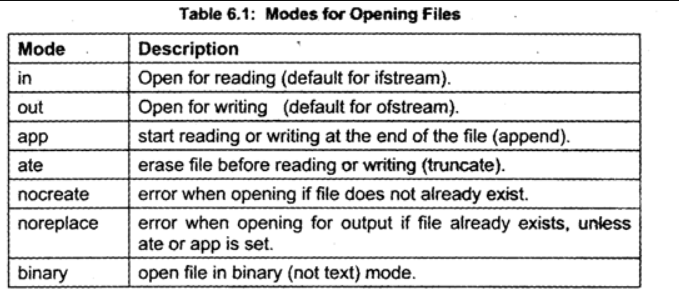

# Потоци

- редица от байтове, които се движат в една посока
- последователен достъп
- iostream (ifstream) - cin, cout (fin, fout)
- get и put указатели, които сочат към следващия елемент за прочитане и записване

| **Функция**                                          | **`ostream` (`cout`)** | **`istream` (`cin`)** | **`ofstream` (файлов изход)** | **`ifstream` (файлов вход)** | **Пример**                                       | **Поток преди**        | **Поток след**   | **Резултат**              | **Забележка**                                                                |
| ---------------------------------------------------- | ---------------------- | --------------------- | ----------------------------- | ---------------------------- | ------------------------------------------------ | ---------------------- | ---------------- | ------------------------- | ---------------------------------------------------------------------------- |
| `put(char ch)`                                       | ✅                     |                       | ✅                            |                              | `std::cout.put('A').put('B');`                   | _(празен изход)_       | `AB`             | `AB`                      |                                                                              |
| `write(const char* str, streamsize size)`            | ✅                     |                       | ✅                            |                              | `std::cout.write("Hello", 2).write("World", 3);` | _(празен изход)_       | `HeWor`          | `HeWor`                   |                                                                              |
| `get(char& ch)`                                      |                        | ✅                    |                               | ✅                           | `std::cin.get(ch);`                              | Вход: `A B`            | Вход: ` B`       | `ch = 'A'`                |                                                                              |
| `get(char* str, streamsize size, char delim = '\n')` |                        | ✅                    |                               | ✅                           | `std::cin.get(str, 10, ',');`                    | Вход: `Hello, World!`  | Вход: `World!`   | `str = "Hello"`           | delimiter е опционален и по подразбиране е `'\n'`                            |
| `getline(char* str, streamsize size,*char delim*)`   |                        | ✅                    |                               | ✅                           | `std::cin.getline(str, 10);`                     | Вход: `Hello\n`        | Вход: _(празен)_ | `str = "Hello"`           | size-1 символа ще бъдат извлечени, тоест size трябва да е размера на стринга |
| `getline(string& str)`                               |                        | ✅                    |                               | ✅                           | `std::getline(std::cin, str);`                   | Вход: `Hello world!\n` | Вход: _(празен)_ | `str = "Hello world!"`    |                                                                              |
| `ignore(streamsize n, int delim)`                    |                        | ✅                    |                               | ✅                           | `std::cin.ignore(3);`                            | Вход: `Hello`          | Вход: `lo`       | _(Пропуска "Hel")_        |                                                                              |
| `peek()`                                             |                        | ✅                    |                               | ✅                           | `char c = std::cin.peek();`                      | Вход: `ABC`            | Вход: `ABC`      | `c = 'A'` (запазва входа) |                                                                              |
| `putback(char ch)`                                   |                        | ✅                    |                               | ✅                           | `std::cin.get(ch); std::cin.putback(ch);`        | Вход: `A B`            | Вход: `A B`      | _(Връща "A" обратно)_     |                                                                              |
| `read(char* str, streamsize size)`                   |                        | ✅                    |                               | ✅                           | `file.read(buffer, 5);`                          | Файл: `HelloWorld`     | Файл: `World`    | `buffer = "Hello"`        |                                                                              |
| `<< `                                                | ✅                     |                       | ✅                            |                              | `std::cout << "Hello World";`                    | _(празен изход)_       | `Hello World`    | `Hello World`             | за текстови файлове, пропуска водещи и крайни интервали и нов ред            |
| `>> `                                                |                        | ✅                    |                               | ✅                           | `std::cin >> str;`                               | Вход: `Hello`          | Вход: _(празен)_ | `str = "Hello"`           | чете до whitespace                                                           |

---

# Флагове

- множество от битове
- ios::goodbit, ios::eofbit, ios::failbit, ios::badbit
- проверяват се със съответните методи, зачистват се с clear(параметър за бит, който да е активен)

# Указатели

- get указател - там ще се извърши следващата операция при четене
- put указател - там ще се извърши следващата операция при писане
- seekg(offset(в байтове), std::ios_base::seekdir (позиция)) и seekp(offset(в байтове), std::ios_base::seekdir (позиция)) преместват get и put указателите
- позициите могат да бъдат ios::beg, ios::end, ios::cur
- tellg() и tellp() връщат позицията на указателите (полезни за разбиране на големината на файла например).

# Файлове

- последователен или пряк достъп
- комуникацията се извършва чрез файлови потоци <fstream>
- отваряне или с <обект-на-файл>.open(<път>,[режим на работа | друг режим на работа...]) или в самата дефиниция подаваме като аргументи
- проверка дали се е отворил успешно
- !КОГАТО ОТВАРЯМЕ ФАЙЛ ЗА ПИСАНЕ ПО ПОДРАЗБИРАНЕ ТОЙ СЕ ИЗТРИВА! - решение ios::app

```c
std::ifstream ifstr("myfile.txt")
if(!ifstr){
    std::cout << "Error opening file!";
    return 1;
}
```



- затваряне <обект-на-файл>.close()

# Задачи за файлове

## Задачи с проекта от миналия път

### Базови

1. bool saveWeaponTextFormat(Weapon*, char*) -> функция която запазва дадено оръжие във файл
2. Weapon* loadWeaponTextFormat(char*) -> функция която зарежда оръжие от файл
3. bool saveCharacterTextFormat(Character*, char*) -> функция която запазва даден герой във файл
4. Character* loadCharacterTextFormat(char*) -> функция която зарежда герой от файл
5. bool saveWorldTextFormat(World*, char*) -> функция която запазва даден свят във файл
6. World* loadWorldTextFormat(char*) -> функция която зарежда свят от файл

### Интересни

7. Character* findCharacter(char*, char\*) -> функция която намира първия играч с това име във файла подаден като втори аргумент и го връща ако съществува, ако ли не връща nullptr.
8. Замислете се дали може да направите горната задача без да гледате всеки един ред на файла.
9. Замислете се дали може да я направите, така че всяко търсене да е константно по време. (Жокер първото ви извикване ще трябва да минете всеки ред)

## Задачи за хората които не им се прави проект

### Лесни

1. Напишете структура File със стойност, име на файл, големина и стрийм към файла
2. Напишете функция File* openFile(char*), която отваря файл с дадено име и връща референция към неговата структура
3. Напишете функция void closeFile(File\*&), която затваря файла и изтрива цялата алокирана памет
4. Напишете функция char* readFile(File*), която чете информацията във файла и след това връща масив с нея

### Интересни

Файловете са със следния формат

```
Name, Age, City, Email
John Doe, 29, New York, johndoe@example.com
Jane Smith, 34, Los Angeles, janesmith@example.com
Alice Johnson, 25, Chicago, alicej@example.com
Bob Brown, 40, Houston, bobbrown@example.com
```

5. Напишете функция char\** parseLines(char_), която разделя входа на всеки нов ред.
6. Напишете функция char**\* parseDelim(char**, char delim), която разделя всеки елемент на char\*\* според променливата delim
7. Напишете структура CSVParsed която пази първия ред на файла и останалите му редове в друга променлива

### Много интересни

Има примерен файл в week3 папката със csv файл 

8. Заредете го напишете функция searchByUser(Char\*), която търси по името на потребител 
9. Пробвайте се да направите горната задача без да гледате всяка една записана шега
