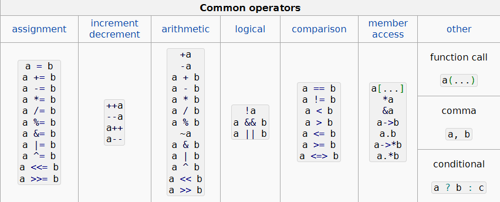

# Предефиниране на оператори

**Overloading an operator cannot change its precedence.
Overloading an operator cannot change its associativity.
Overloading an operator cannot change its "arity" (i.e. number of operands)
It is not possible to create new operators -- only new versions of existing ones.
Operator meaning on the built-in types cannot be changed.**

- не могат да се предефинират :
  . - оператор за избор на компонента на клас,
  .\* - оператор за избор на компонента на клас чрез
  указател,
  :: - оператор за присъединяване,
  ?: - тернарен оператор
  

## Задачи

1. За Weapon : Оператори: (==) - сравняване на два weapon-а, (+=) увеличаване на strength или intelligence скейлинг и да може да се сменят(т. е да се избира кое от двете), (++) същото, но с фиксирана единица, да се помисли как да се сменя, (<<) за принтиране.
2. Character: Оператори: (!) дали е умрял,(+=) оръжие да equip-ва, (-=) оръжие да премахва, (+= и -=) за currHp- с проверка, (+=, -=) за съответните статове и да може да се сменят, (> , <, ==) дали ще победи в битка друг играч или ще са равни.
3. Arena: (<<) принтиране на живите (\*) битка до последен оцелял.

## Задача 2 (Библиотека за смятане на дроби)
1. Дефинирайте клас за дробно число
2. Предефинирайте операторите: ==, !=, =
3. Предефинирайте операторите: >, <, >=, <=
4. Предефинирайте оепраторите: +, -, +=, -=, ++, --
5. Предефинирайте оепратора: [], така че да може да взимате горната и долната част на дробта(Тоест с индекс 0 се взима горната с индекс 1 се взима долната)
