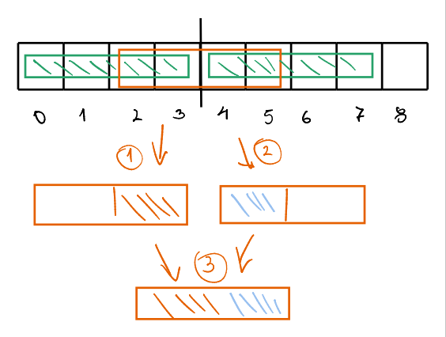
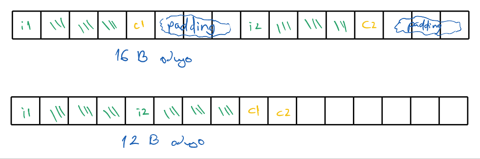

# ООП Семинар 02 -- Структури. Разделна компилация

## Структури

Крайна редица от елементи, които могат да бъдат от различен тип. Описват една обща характеристика, един общ обект.

- <https://en.cppreference.com/w/cpp/keyword/struct>, допълнение: <https://en.cppreference.com/w/cpp/language/class>

Пример за структура:

```cpp
#include <cstring>
#include <iostream>

struct Person {
    char firstName[36];
    char lastName[36];
    int age;
};

int main() {
    Person p1;

    // If the fields in the struct are uninitialized their value is unknown
    std::cout << p1.firstName << " " << p1.lastName << std::endl;

    // User operator `.` to access the fields of the instance
    p1.age = 24;
    std::cin >> p1.lastName;
    strcpy(p1.firstName, "John");
    std::cout << p1.age << " " << p1.firstName << " " << p1.lastName << std::endl;

    return 0;
}
```

Можем да влагаме структури:

```cpp
struct Person {
    char firstName[36];
    char lastName[36];
    int age;

    Person *parent; // If we use the type itself we'd be trying to define Person using Person!
};
```

**Не можем** да въвеждаме или да извеждаме целия тип, защото компилатора няма информация как точно да го направи:

```cpp
int main() {
    Person p1;

    std::cin >> p1; // Compile error!
    std::cout << p1; // Compile error!

    return 0;
}
```

По-нататък в курса ще може да правим въвеждане и извеждане на нашите собствени типове чрез операторите `<<` и `>>`.

---

При присвояване на инстанция на една структура на инстанция на друга структура, се прави копие 1 към 1 на съдържанието в паметта.
Това означава, че може да възникнат проблеми при използване на динамична памет -- от една страна споделяне на памет (което може да не непременно лошо),
но и изтичане на памет. Пример:

```cpp
struct Person {
    char *firstName;
    int age = 10;
};

int main() {
    Person p1;
    p1.firstName = new char[50];
    strcpy(p1.firstName, "John");

    Person p2;
    p2.firstName = new char[50];
    strcpy(p2.firstName, "Jane");


    p1 = p2; // Causes a memory leak!

    delete[] p1.firstName;
    delete[] p2.firstName;
    
    return 0;
}
```

### Подаване по стойност, указател и референция

```cpp
struct Person {
    char firstName[36];
    char lastName[36];
    int age;
};

// A copy of the struct is made.
void printCopy(Person p) {
    std::cout << p.firstName << " " << p.lastName << " " << p.age << std::endl;
}

// To avoid copying all the data, we may use a pointer
// We don't want to modify the person thus we use const
void printPointer(const Person *p) {
    // We need to dereference the pointer first and then use the `.` operator
    std::cout << (*p).firstName << " " << (*p).lastName << " " << (*p).age << std::endl;
    // Instead of using `*` and `.` we'll use operator `->` which does the same
    std::cout << p->firstName << " " << p->lastName << " " << p->age << std::endl;
}

// Using references is the preferred way in modern C++
void printReference(const Person &p) {
    std::cout << p.firstName << " " << p.lastName << " " << p.age << std::endl;
}

int main() {
    Person p1{"Jane", "Doe", 10}; // This initializes the fields with the given values
    printCopy(p1);

    printPointer(&p1);

    printReference(p1);

    return 0;
}
```

В модерен C++ за предпочитане в повечето случаи е да се ползват референции -- не се прави копие на данните, както и се позволява на компилатора
да прави оптимизации. Ако обаче трябва да пишем нещо, съвместимо със C, няма как да използваме референции.

### Размер и подравняване

При работата с паметта не е ефикасно данните да се разполагат по произволен начин, тъй като работата с тях би изисквала допълнителлни изчислителни
ресурси. За да се избегнат тези проблеми, данните се подравняват, в зависимост от размера си. (на английски alignment)



Когато имаме структури, техните полета се разполагат последователно в паметта, като за да са подравнени правилно се използва padding.

```cpp
#include <iostream>

struct Test1 {
    int i1;
    char c1;
    int i2;
    char c2;
};

struct Test2 {
    int i1;
    int i2;
    char c1;
    char c2;
};

int main() {
    std::cout << sizeof(Test1) << std::endl;
    std::cout << sizeof(Test2) << std::endl;

    return 0;
}
```



### Битови полета

- <https://en.cppreference.com/w/cpp/language/bit_field>
- Можем да ги ползваме, така че структурите да заемат по-малко памет;
- Трябва да се внимава с използването им когато искаме преносимост на кода, тоест той да работи правилно на различни архитектури.

Пример за използване:

```cpp
#include <iostream>

struct Date {
    unsigned short WeekDay;
    unsigned short MonthDay;
    unsigned short Month;
    unsigned short Year;
};

struct DateBitfield {
   unsigned short WeekDay  : 3;    // 0..7   (3 bits)
   unsigned short MonthDay : 5;    // 0..31  (5 bits)
   unsigned short Month    : 4;    // 0..12  (4 bits)
   unsigned short Year     : 8;    // 0..100 (8 bits)
};

int main() {
    std::cout << sizeof(Date) << std::endl;
    std::cout << sizeof(DateBitfield) << std::endl;

    return 0;
}

```

### [Обединение (union)](https://en.cppreference.com/w/c/language/union)

## Разделна компилация

Дава ни възможност да организираме по-добре кода, правейки го по-четим и лесен за употреба.

### [Фази на транслация](https://en.cppreference.com/w/cpp/language/translation_phases)

### Header файлове

Ще слагаме декларациите на нещата, които искаме да отделим. Най-често ще бъдат с разширение `.hpp`.

#### Header guards

Ако включим един такъв файл повече от веднъж, може да възникне дублиране на код и съответно грешка. За да се предпазим използваме или

```cpp
#pragma once

// ...
```

или

```cpp
#ifndef HEADER_HPP
#define HEADER_HPP

// ...

#endif
```

И двете вършат работа, но второто е по-преносимо, тъй като първия вариант разчита на имплементация в конкретния компилатор.

#### Разликата между "" и <> при включване на файлове

- `<>` търси в т. нар. include path, тоест там, където бихме имали някакви общи неща, които компилатора/системата ползва за различни проекти;
- `""` търси в текущия проект.

## Задачи

### Задача 1

Напишете структура `Triangle`, която представя тригълник в равнината чрез трите му върха. За целта направете и структура, която представа двумерна
точка. Реализирайте функции за:

- пресмятане на периметъра на триъгълника
- намиране на лицето на триъгълника
- принтиране на данните за триъгълника (координатите на точките му, лицето и периметъра)

При реализация на решението, използвайте разделна компилация.
